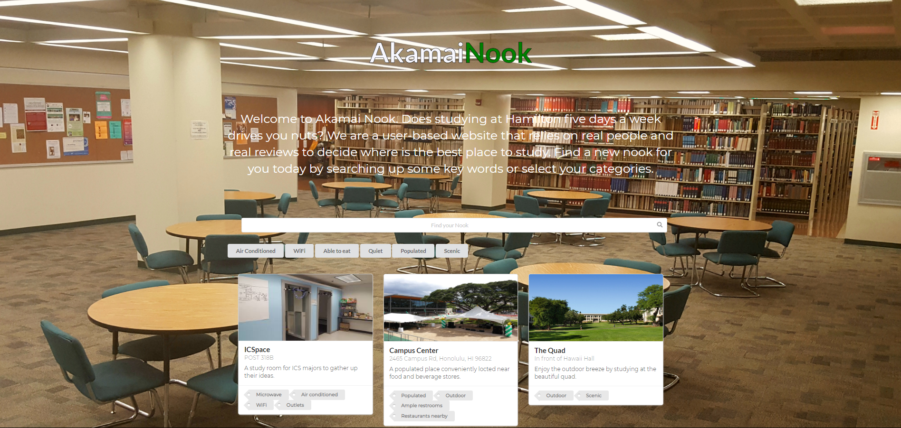
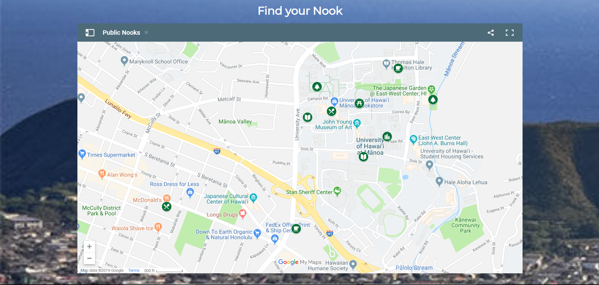

***[Check it Out for Yourself!](http://akamainook.meteorapp.com/#/)*** or ***[Check out the github.io page!](https://akamainook.github.io/)*** for a more information.

### Website Screenshots

### Introduction
For the last month and a half of my ICS 314 class, we developed a website as a group assignment. My following group members: Luke and Jiajun were assigned the "Mānoa Study Spots," in which students would be able to browse through study spots found around the Manoa area. Before this assignment, we worked on many smaller tasks of little tasks that involved the use of the React, MongoDB, and Semantic UI.

### An entertaining (_but difficult_) experience
My group and I especially stumbled with a several a few hurdles. One of the biggest to overcome was our difficulty in approaching the assignment. Early on we just kept coming up with ideas and features that we wanted to implement in the application. As a result, our hubris made the path to starting the project seem daunting. But we managed to get through it by first deciding on what key pages we wanted on the website and designed mock-up pages with the end picture in mind. I worked on the **Admin** and **Profile** pages. Although I was satisfied with how the **Admin** mock-up turned out, I was disappointed with how the result of the **Profile** mock-up turned out. But it was a place holder since it only represented how the page may look. 

The second hurdle my group and I faced was difficulty in utilizing GitHub and the GitHub project boards. Both were entirely new to me as I had no prior experience with using GitHub to develop code. Looking back on it now, the system of adding issues/assigning issues/creating branches/publishing branches/merging branches was incredibly helpful in guiding my group and me on a productive path. Throughout the project, we had to adjust to the learning curve. As a result of our misunderstanding of creating issues, I've noticed an odd gap in the issue count. But going forward both in school and in future jobs, I can feel confident in utilizing GitHub to develop projects later down the road. Through GitHub, we were able to depict our ideas as components of the website we wished to implement. As a result of the more efficient project planning process, I feel as though we were able to work more efficiently as we mainly focused on the current issue we were assigned and would pick up another task to work on once completed with our current one.

The last major hurdle my group and I faced was the difficulty in working together as a group. Unlike the other classes of the ICS program here at Manoa, this is the first class in which we developed a project of significance as a small group. Opposed to other assignments in which we developed code on our own, this task required the input of others, which added another level of complexity to programming. Luckily in my case, I believe my group and I gelled well together. We did not have much debates or complications in our thoughts or ideas. Furthermore, our schedules worked well in our favor as we had free time after class to work on it together. Other than in-person discussions, most of the communication was done through Slack.

All in all, I thoroughly enjoyed working on it. I do not doubt that the knowledge and experience I have gained throughout this assignment will be valuable later on in my progress through college and in my career as a Computer Scientist.

 
