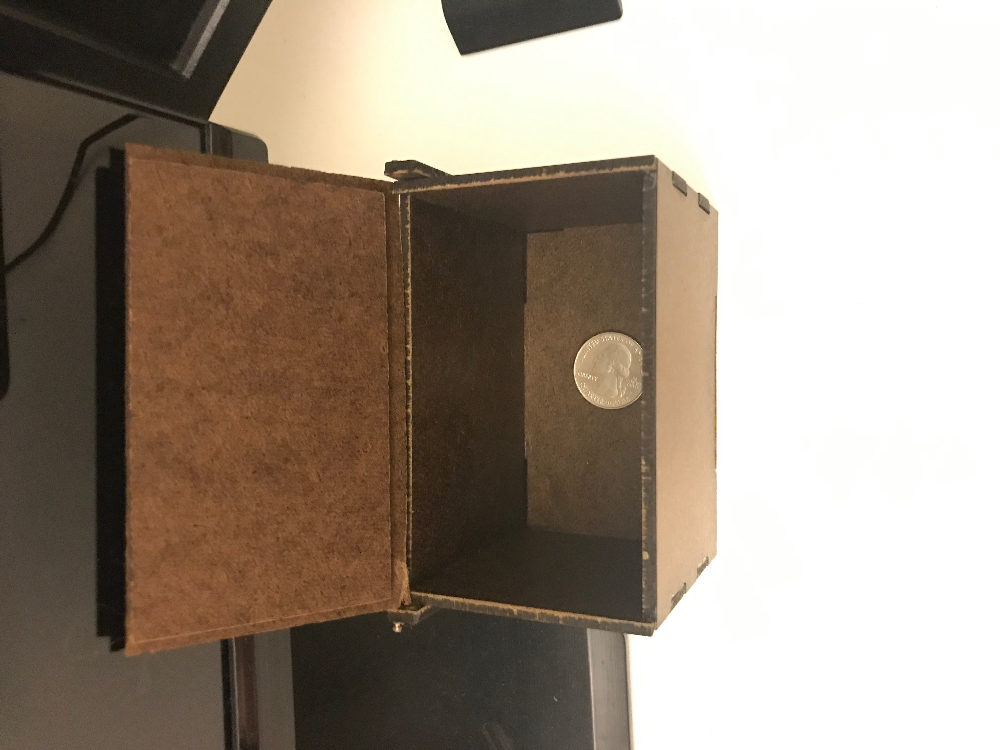

In high school I enrolled in a CAD and mechanical drawing class. As special project that we underwent was trying to learn how to
make a wooden boxes that had to be cut out from a 12 x 12 inch piece of wood. The most difficult specification for one of the boxes was 
learning how to make a living hinge box. Prior to that assignment, we had not physically made anything or used a laser cutter. So much of 
the time spent on the project was learning about how a living hinge worked and how it could be best implemented. However, determining the 
width of material to cut out of the wood was difficult and took trial and error to come up with the final design of the box. One of the 
other difficult tasks was that we had to implement a way of getting the second box to open and close. What proved to be most difficult in 
that case was that the thickness of the wood was only 1/8 of an inch, and so there was not really any way to put a hinge on the box, so I 
had to implement a makeshift one myself. I did so by drilling tiny holes into the side of the of the wooden piece and cutting out two 
wooden braces that would hold a pin that could then hold the lid of the box in place.

This project was an individual one. Other than the resources that were provided for my, I had to perform the tasks entirely on my own. I 
did, however use online resources to read up on how a living hinge was made. I did collaborate with classmates to see if we had any unique 
ideas on how to carry out a way of getting the box to have fully functional lid. 

This project was difficult in that I had to learn how to plan out the best way to make use of given resources (how to make a box that
could have the largest volume despite a 12" x 12" piece of wood. Near the end of the process I had to also learn how to operate and change 
the drill bit of a drill press. The most interesting learning process involved using a laser cutter. Since they were relatively new
technology at the time, it was an exciting experience learning how to use the software and how to operate the machine. 

