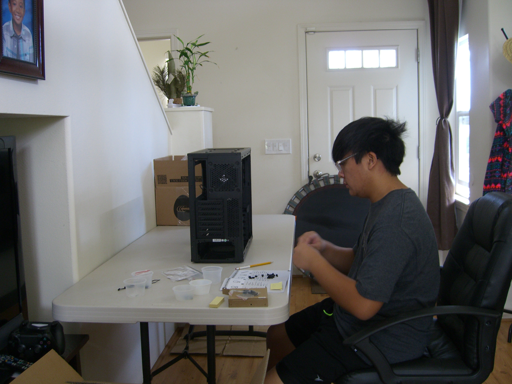
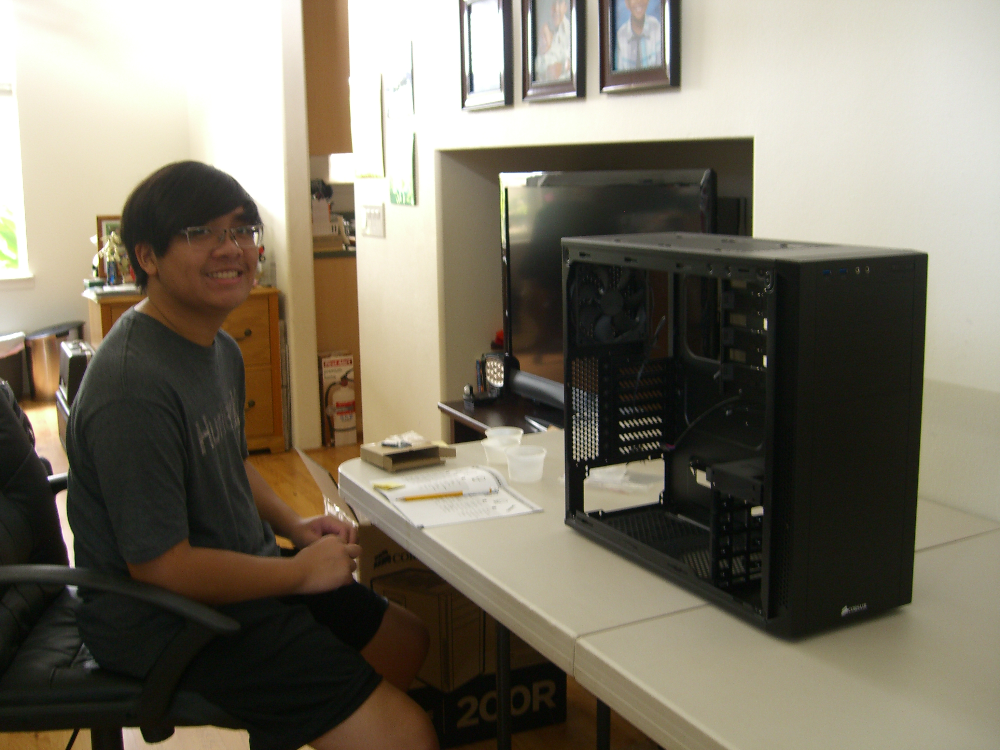
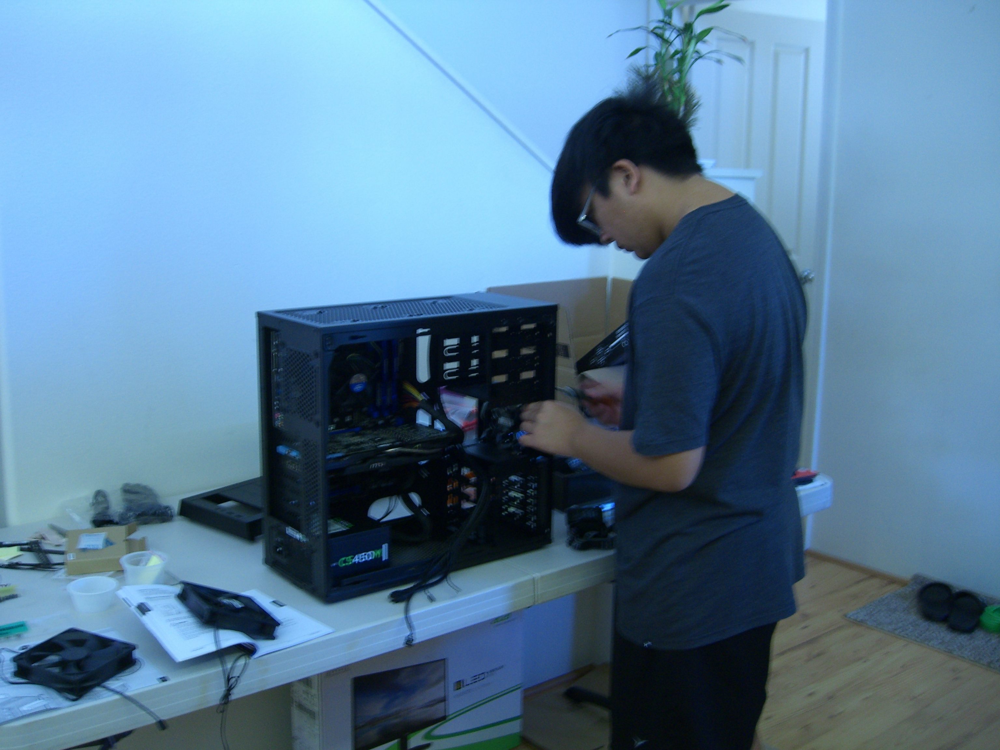
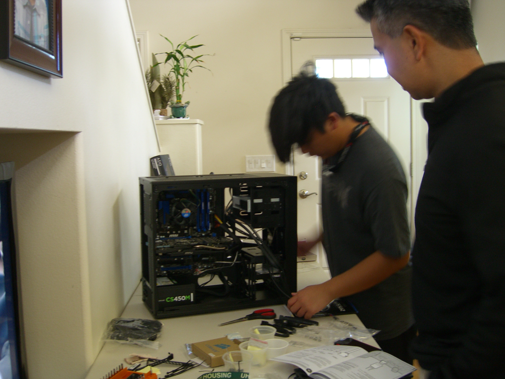

<div class="ui small rounded images">
  
  
  
  
</div>
During my sophomore year of highschool I had wanted a dedicated gaming computer. However, I did not want to just buy any pre-built rigs 
online. I thought that it would be more worth my money, time, and interest if I learned to build one instead. So for my upcoming 
birthday, I had asked my parents if I could buy computer parts to build my own rig. My father was supportive of my aspiration as he had 
built one himself, but my mother was a bit skeptical. Nevertheless, they granted me permission to go ahead, but with a budget of one 
thousand dollars. So for the next three months, I spent my time watching tutorials, reading, and researching parts: trying to form a 
list of parts that I wanted. After ordering the parts, I was finally able to start my build two weeks later. I spent nearly twelve hours 
installing all the components and organizing the wires. In the end I was incredibly proud of myself and about the feat that I had 
just accomplished.

This project was done almost entirely on my own. From researching and building, I put in an incredible amount of time and effort to make 
sure that I was careful with the components I was handling, as I was fearful of damaging them beyond repair. The only other person that 
had helped me throughout this personal project of mine was my father. The only roles he played in the process was approving of my
component list as well as helping me organize the wiring of the computer. 

This was an empowering experience for me as it sparked my interest in computers and is what ultimately pushed me to want to learn even
more about computers. Throughout the researching process I had learned what each component was responsible for and what to look for in
the market. This personal project was also proved to be vital in learning how to make purchases on a budget and how to make the best 
"bang for the buck" purchase. Without this experience I would not have developed the passion I have for technology I have today. 


Here are the Specifications of the Build:

```
CPU: i5-4440 3.1 GHz
Motherboard: MSI Z97S SLI Plus ATX LGA1150
RAM: Kingston HyperX Fury Blue 16 GB
Storage: - Sandisk 128GB SSD
         - Western Digital Caviar Blue 1TB
GPU: MSI R9 280 3GB TWIN FROZR
Case: Corsair 200R
PSU: Corsair CSM 450w 80+ Gold Semi-Modular
```


