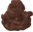

In my first ever programming class, ICS 111, we developed a simple AI which was meant to behave like a roomba. We made a room in a text
file in which each "D", "W", and "R" was replaced with a picture of a wall, dirt pile, and roomba respectively. In this assignment we
needed to program the roomba to move around and bounce off any wall at a fourty-five degree angle. Prior to this we had only one
programming project, on which I did horribly, so this first successfull project was a significant milestone for me.

This project was exceptionally difficult for me since it was my second significant programming assignment. Without any other form of
help other than my Teaching Assistant for the class, I completed the project on my own. What made the development of the program easy
was the hints and practice that we experienced in the class labs. Although not giving us the answer, the labs would be oriented to give
us better comprehension of how the functions of the roobrah should work.

The most challenging aspect I had with the assignment was determining how the roobrah would know when it would hit a dirt pile and 
thereby remove it from the screen. To do so I had to learn how to calculate the image dimensions of both the roombrah and dirtpiles. I 
also had to learn how to keep track of the center of the roombrah's image so that I could update the position of the roombrah and 
visually represent it on screen.


<div class="ui small rounded images">
	
	
	
	
</div>

Here is the code which modeled the behavior of the roobrah:
```java
for(int i=0; i<wallCount; i++){
			
			if(wallArray[i].isPointInElement(posX+dirX,posY)){	//reverse the x direction
				dirX=-dirX;
			}
			if(wallArray[i].isPointInElement(posX,posY+dirY)){	//reverse the y direction
				dirY=-dirY;
			}

```


